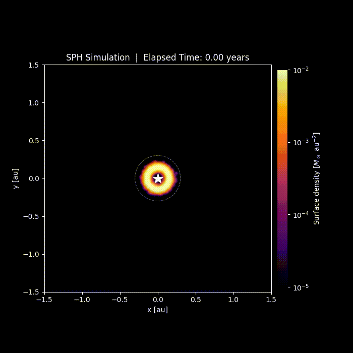

# SPH Binary Simulation

A 2D Smoothed Particle Hydrodynamics (SPH) solver for simulating a gas ring around a central star perturbed by an eccentric binary companion.

<p align="center">
  
</p>

## Overview

This code models a circum-primary gas disk in a binary star system using the SPH method. A ring of gas particles orbits a central mass **M1** and is tidally perturbed when the companion **M2** passes through periastron on a highly eccentric orbit.

### Physics

- **Isothermal equation of state** — pressure is proportional to density
- **M4 cubic spline kernel** — compact support within 2h
- **Adaptive smoothing lengths** — iteratively adjusted to track local density
- **Monaghan (1997) artificial viscosity** — signal-velocity formulation for shock capturing
- **Adaptive CFL timestep** — guarantees numerical stability
- **Velocity-Verlet (KDK) integrator** — symplectic, with force caching across steps
- **Tidal perturbation** — companion gravity computed only when within 2 AU (skipped when distant for performance)

### Performance

Overall complexity is **O(N log N + M)** per step, where M is the number of neighbour pairs.

- **Numba JIT + fastmath** — density and force kernels compiled to parallel native code via `@njit(parallel=True, fastmath=True)`
- **scipy cKDTree** — neighbour search via optimised C KD-tree; CSR built with O(M) Numba scatter (no sorting)
- **Force caching** — forces computed once per step and reused, halving the work of a naive KDK scheme
- **Single tree build per step** — the CSR from the smoothing-length iteration is reused for forces
- **Density-only kernel** — `kernel_W` skips gradient computation, saving work on millions of density evaluations
- **Pre-computed pressure term** — `cs²/ρ` computed once per step, avoiding redundant divisions in the inner loop
- **Lazy tidal force** — companion gravity skipped entirely when distance > 2 AU

## Requirements

```bash
pip install -r requirements.txt
```

Optional: `ffmpeg` on `PATH` for MP4 output (falls back to GIF via Pillow otherwise).

## Usage

```bash
python main_sph.py
```

An interactive parameter panel is displayed at startup. Press **Enter** to accept defaults, or type a parameter number to change it. Type **q** when done editing.

### Default Parameters

| Group | Parameter | Default | Description |
|---|---|---|---|
| **Stars** | `M1` | 10.29 M_sun | Central star mass |
| | `M2` | 4.5 M_sun | Companion mass |
| | `a2` | 19.8 au | Companion semi-major axis |
| | `e2` | 0.98 | Companion eccentricity |
| **SPH** | `eta` | 1.2 | Smoothing-length parameter |
| | `h_min` / `h_max` | 1e-4 / 0.03 au | Smoothing-length bounds |
| | `alpha_visc` / `beta_visc` | 0.1 / 0.2 | Artificial viscosity coefficients |
| **Ring** | `N_seed` | 1000 | Initial number of particles |
| | `M_disk_seed` | 1e-3 M_sun | Total ring mass |
| | `r_inj` | 0.15 au | Injection / seed radius |
| **Injection** | `N_dot` | 0 yr^-1 | Particle injection rate (0 = off) |
| | `v_inj` | 0 au/yr | Injection velocity (0 = Keplerian) |
| **Simulation** | `t_end` | 1.0 yr | Total simulation time |
| | `n_frames` | 300 | Animation frames |

See the `DEFAULTS` dict in `main_sph.py` for the full list.

## Output

Each run creates a timestamped folder `run_YYYYMMDD_HHMMSS/` containing:

| File | Description |
|---|---|
| `sph_simulation.mp4` | Animated density field with Gaussian-splatted rendering |
| `time_series.png` | Mean ring radius vs time diagnostic plot |
| `diagnostics.log` | Full parameter dump and per-step runtime log |

### Rendering

Particles are visualised as a smooth density field: masses are deposited onto a 2D histogram and convolved with a Gaussian kernel matching the mean SPH smoothing length. The result is displayed with the `inferno` colormap on a logarithmic scale.

## Project Structure

```
SPH_G/
├── main_sph.py        # Full simulation code (single-file)
├── requirements.txt   # Python dependencies
├── README.md
└── assets/
    └── sph_simulation.gif # Preview animation
```

## License

This project is provided as-is for research and educational use.
